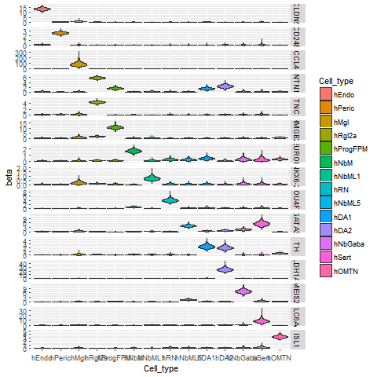
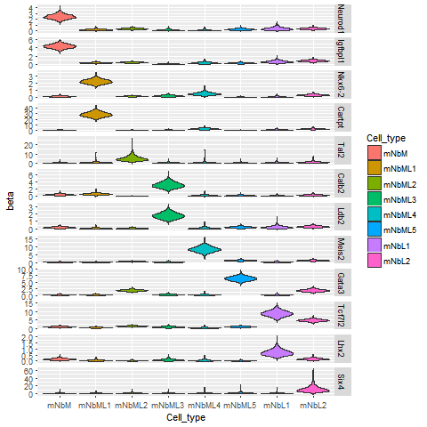

## BayesianGLM
Bayesian generalized linear regression model for estimation of cell-specific effect for gene expression[(La Manno et al.Cell 2016)](http://linnarssonlab.org/publications/2016/10/06/midbrain/) in R and Rstan.  
Easy to understand example of MCMC is [here](http://www.bewersdorff-online.de/amonopoly)

### How to use
#### Installation
1. Clone or download repository and create OUTPUT and DATA directory in the repository directory.  
2. Download datafiles(.cef) to DATA directory from [the authors repository](https://github.com/linnarsson-lab/ipynb-lamanno2016/tree/master/data).  
Note: If you use UNIX, these procedure are automated in init.sh.

#### Package Requirement
Rstan, ggplot2, pipeR, foreach, reshape2, dplyr, tibble

Option for parallelization
doParallel

### Execution
Run "runGLM.R"  
You can modify DATASET/GENESET/CELLTYPESET in the script to create your own plot.

### Figures 
Figure 2F  without violin plot scaled       

       
Figure 4A, scaled to width in [Violinplot.R](https://github.com/ToledoEM/BayesianGLM/blob/master/src/Violinplot.R)        

    

